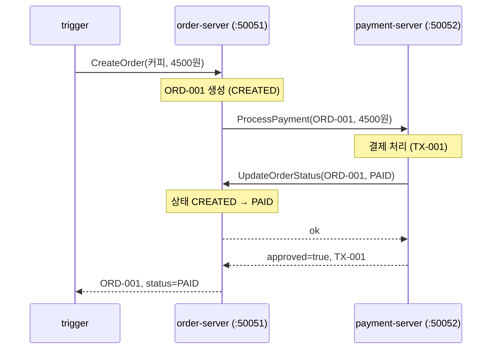
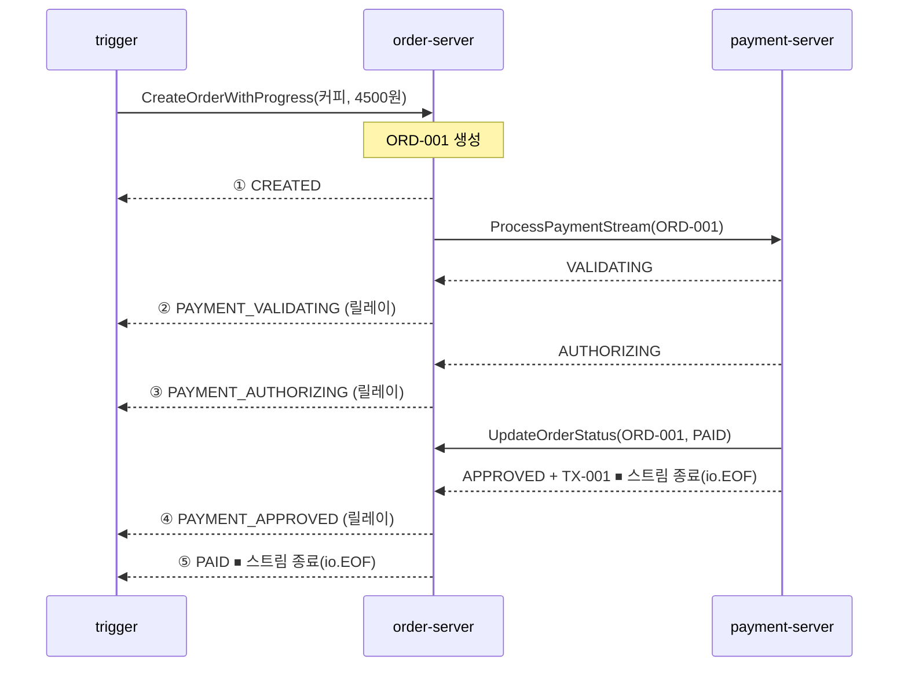
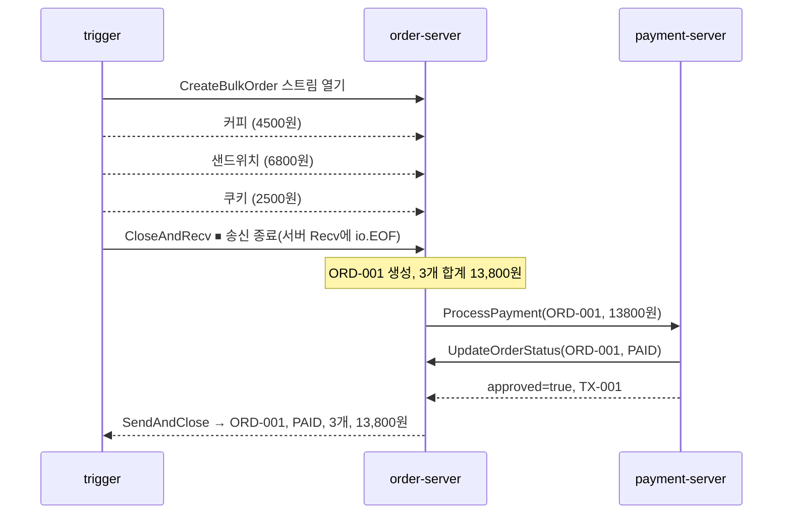
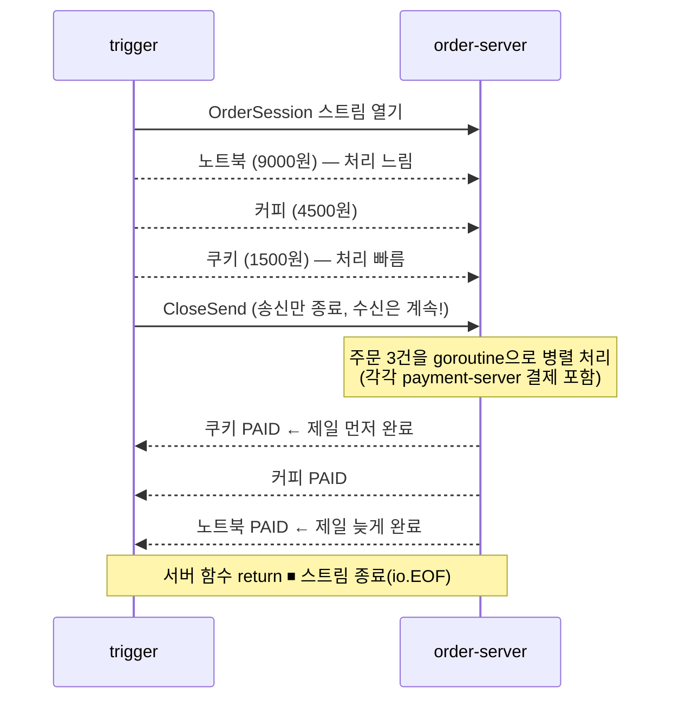

# gRPC 튜토리얼 (Go)

gRPC를 처음부터 단계별로 배우는 실습 프로젝트입니다.

## gRPC란?

**gRPC는 다른 서버에 있는 함수를 내 로컬 함수처럼 호출하는 기술**입니다 (RPC = Remote Procedure Call). Google이 만들었고, 마이크로서비스 간 통신에 널리 쓰입니다.

두 개의 층으로 이해하면 쉽습니다:

- **인터페이스 층** — `.proto` 파일. "어떤 함수가 있고 입출력이 어떻게 생겼는지"만 정의하는 언어 중립 계약서.
- **통신 층** — gRPC 런타임. 호출을 바이너리로 직렬화하고 HTTP/2로 실어 나른 뒤 복원하는 실행 엔진.

REST와 비교하면:

| | REST | gRPC |
|---|---|---|
| 데이터 포맷 | JSON (텍스트) | Protocol Buffers (바이너리 — 더 작고 빠름) |
| 계약 정의 | 문서/OpenAPI (선택) | `.proto` 파일 (필수 — 코드 자동 생성) |
| 전송 프로토콜 | HTTP/1.1 | HTTP/2 (멀티플렉싱, 스트리밍 지원) |
| 호출 형태 | URL + HTTP 메서드 | 함수 호출처럼 (`client.CreateOrder(...)`) |

브라우저는 네이티브 gRPC를 직접 말하지 못하므로, 실제 주 무대는 **백엔드 서버 간 내부 통신**입니다.

## 프로젝트 구조

```
grpc-tutorial/
├── proto/
│   ├── order.proto        OrderService 계약 (order가 제공, payment도 호출용으로 사용)
│   └── payment.proto      PaymentService 계약 (payment가 제공, order가 호출용으로 사용)
├── gen/
│   ├── orderpb/           order.proto에서 생성된 코드 (수정 금지)
│   └── paymentpb/         payment.proto에서 생성된 코드 (수정 금지)
├── order-server/main.go   :50051 — OrderService 구현 + PaymentService 호출
├── payment-server/main.go :50052 — PaymentService 구현 + OrderService 호출
└── trigger/main.go        데모 시작용 CLI (아키텍처의 일부가 아니라 "발사 버튼")
```

## 사전 준비

```bash
# protobuf 컴파일러
brew install protobuf

# Go 코드 생성 플러그인 2개
go install google.golang.org/protobuf/cmd/protoc-gen-go@latest
go install google.golang.org/grpc/cmd/protoc-gen-go-grpc@latest

# 플러그인이 설치되는 ~/go/bin을 PATH에 추가 (~/.zshrc에 등록 권장)
export PATH="$PATH:$HOME/go/bin"
```

## 코드 생성

`.proto` 파일을 수정할 때마다 다시 실행합니다:

```bash
protoc \
  --go_out=. --go_opt=module=grpc-tutorial \
  --go-grpc_out=. --go-grpc_opt=module=grpc-tutorial \
  proto/order.proto proto/payment.proto
```

## 실행 방법

터미널 3개를 열고:

```bash
go run ./order-server     # 터미널 1: 주문 서버 :50051
go run ./payment-server   # 터미널 2: 결제 서버 :50052
go run ./trigger          # 터미널 3: 주문 한 건 발사 — 1단계 unary 버전
go run ./trigger stream   # 터미널 3: 같은 주문을 2단계 streaming 버전으로
go run ./trigger bulk     # 터미널 3: 장바구니 주문 — 3단계 client streaming 버전
go run ./trigger session  # 터미널 3: 주문 세션 — 4단계 bidirectional streaming 버전
```

성공하면 trigger에 `주문 결과: id=ORD-001, status=PAID`가 출력되고, 두 서버 로그에서 상호 호출 과정을 볼 수 있습니다.

> 참고: 이 예제에는 **중첩 호출**이 있습니다 (order가 payment를 기다리는 동안 payment가 order를 되부름). 데드락이 안 나는 이유는 gRPC가 요청마다 별도 goroutine으로 처리하기 때문이며, 그래서 공유되는 `orders` 맵에 `sync.Mutex`를 걸었습니다.

---

## 학습 로드맵

gRPC의 통신 방식은 딱 4가지이고, proto에서 `stream` 키워드의 위치로 구분됩니다:

| 단계 | 방식 | proto 시그니처 | 요청 : 응답 |
|---|---|---|---|
| 1 | Unary | `rpc F(Req) returns (Res)` | 1 : 1 |
| 2 | Server Streaming | `rpc F(Req) returns (stream Res)` | 1 : N |
| 3 | Client Streaming | `rpc F(stream Req) returns (Res)` | N : 1 |
| 4 | Bidirectional | `rpc F(stream Req) returns (stream Res)` | N : N |

### ✅ 1단계: Unary RPC + 서버 간 상호 호출 (완료)

가장 기본 형태 — **요청 1개를 보내면 응답 1개가 돌아옵니다.** REST API 호출과 가장 비슷한 모델입니다.

**추가된 것**

| 무엇 | 어디에 |
|---|---|
| `rpc CreateOrder`, `rpc UpdateOrderStatus` | `proto/order.proto` → order-server가 구현 |
| `rpc ProcessPayment` | `proto/payment.proto` → payment-server가 구현 |
| 실행 | `go run ./trigger` |

**동작 방식** — 주문 한 건이 처리되는 동안 두 서버가 서로를 한 번씩 호출합니다:



order-server가 `ProcessPayment` 응답을 기다리는 **도중에** payment-server가 `UpdateOrderStatus`로 되부르는 중첩 호출 구조입니다. gRPC가 요청마다 별도 goroutine을 쓰기 때문에 데드락 없이 동작합니다.

배운 것:

- **`.proto` 계약서**: `service`(호출 가능한 rpc 목록), `message`(데이터 구조). 필드 뒤 숫자(`string name = 1;`)는 값이 아니라 바이너리 직렬화용 필드 번호이며 한번 정하면 바꾸면 안 됩니다.
- **코드 생성**: `protoc`가 메시지 구조체와 통신 코드(서버 인터페이스 + 클라이언트 스텁)를 자동 생성. 생성 코드는 직접 수정하지 않습니다.
- **server/client는 역할**: 한 프로세스가 서버이자 클라이언트가 될 수 있고, 실무 마이크로서비스가 그렇습니다.
- **호출 가능 함수의 두 관문**: proto `service` 선언 + `RegisterXxxServer` 등록. 둘 다 통과해야 외부에서 호출됩니다.
- **관례**: 모든 호출에 `context.WithTimeout`으로 데드라인을 걸고, 데드라인은 하위 호출로 전파됩니다. 로컬은 `insecure`, 운영은 TLS 필수.

### ✅ 2단계: Server Streaming (완료)

요청 1개 → **응답 여러 개**. 연결이 열린 채로 서버가 원하는 만큼 메시지를 흘려보냅니다. 예: 실시간 알림, 진행 상황 보고, 대량 데이터 조회.

**추가된 것**

| 무엇 | 어디에 |
|---|---|
| `rpc CreateOrderWithProgress(...) returns (stream OrderProgress)` | `proto/order.proto` → order-server가 구현 |
| `rpc ProcessPaymentStream(...) returns (stream PaymentProgress)` | `proto/payment.proto` → payment-server가 구현 |
| 실행 | `go run ./trigger stream` |

**동작 방식** — payment가 결제 진행 단계를 스트림으로 흘려보내면, order가 받는 족족 trigger에게 릴레이합니다. 점선 하나하나가 스트림 조각입니다:



Unary는 다 끝난 뒤 결과 1개가 오지만, 여기서는 trigger가 ①~⑤를 **진행되는 순간마다 실시간으로** 받습니다.

배운 것:

- **proto 문법**: `returns (stream OrderProgress)` — returns 앞에 `stream` 키워드 하나가 전부입니다.
- **서버 구현**: 응답을 return하지 않고 `stream.Send()`를 반복 호출. 함수가 return하는 순간 스트림 종료가 클라이언트에 전달됩니다. ctx는 `stream.Context()`로 꺼냅니다.
- **클라이언트 수신 관용구**: `Recv()`를 반복하다 `io.EOF`가 오면 정상 종료. (`trigger/main.go`의 `runStream`, `order-server`의 payment 스트림 수신 루프)
- **릴레이 패턴**: `CreateOrderWithProgress`는 payment의 스트림을 받는 클라이언트이면서, 받은 조각을 자기 호출자에게 `Send`하는 서버입니다 — 스트리밍의 양쪽 입장을 한 함수에서 볼 수 있습니다.
- **Unary와의 차이 체감**: unary는 다 끝난 뒤 결과 1개, streaming은 진행 상황이 실시간으로 도착 (`go run ./trigger` vs `go run ./trigger stream`).

### ✅ 3단계: Client Streaming (완료)

**요청 여러 개** → 응답 1개. 클라이언트가 원하는 만큼 보내고, 서버는 다 받은 뒤 한 번에 응답합니다. 예: 파일 업로드(청크 단위), 로그/메트릭 수집, 장바구니.

**추가된 것**

| 무엇 | 어디에 |
|---|---|
| `rpc CreateBulkOrder(stream CartItem) returns (CreateBulkOrderReply)` | `proto/order.proto` → order-server가 구현 |
| 실행 | `go run ./trigger bulk` |

**동작 방식** — 2단계와 화살표 방향이 반대입니다. trigger가 상품을 하나씩 스트림으로 보내고, order는 다 받은 뒤 합산해서 응답 1개로 마무리합니다:



결제 부분은 1단계의 unary `ProcessPayment`를 그대로 재사용합니다 — 한 서비스 안에서 통신 방식들을 섞어 쓸 수 있습니다.

배운 것:

- **proto 문법**: `rpc CreateBulkOrder(stream CartItem) returns (...)` — 이번엔 `stream`이 파라미터 쪽에 붙습니다.
- **서버 구현**: 시그니처에 요청 파라미터가 아예 없고(요청들이 stream 안에서 나옴), `Recv()` 루프로 받다가 `io.EOF` 후 **`SendAndClose()`** 로 응답 1개를 보내며 마무리.
- **클라이언트 관용구**: 스트림을 열고 `Send()` 반복 → **`CloseAndRecv()`** 로 "다 보냈다"고 알리고 응답을 기다림. 이 호출이 서버의 `Recv()`에 `io.EOF`를 발생시킵니다.
- **2단계와의 대칭**: server streaming의 `Send 반복/return` ↔ client streaming의 `SendAndClose`, `Recv 루프/io.EOF`는 양쪽에서 같은 관용구로 재사용됩니다.

### ✅ 4단계: Bidirectional Streaming (완료)

**요청 여러 개 ↔ 응답 여러 개**, 하나의 연결 위에서 동시에. 핑퐁(요청 하나-응답 하나 교대)이 아니라 **전이중(full-duplex)** — 송신과 수신이 서로를 기다리지 않습니다. 예: 채팅, 실시간 협업, 장시간 유지되는 처리 파이프라인.

**추가된 것**

| 무엇 | 어디에 |
|---|---|
| `rpc OrderSession(stream CreateOrderRequest) returns (stream OrderResult)` | `proto/order.proto` → order-server가 구현 |
| 실행 | `go run ./trigger session` |

**동작 방식** — trigger가 주문을 연달아 흘려보내면, order-server는 주문마다 goroutine을 띄워 병렬 처리하고 **끝나는 순서대로** 결과를 돌려보냅니다. 금액이 클수록 심사가 오래 걸리게 해뒀기 때문에, 먼저 보낸 주문의 결과가 나중에 도착합니다:



실제 실행 결과 — 보낸 순서(노트북→커피→쿠키)와 **반대 순서**로 결과가 도착합니다:

```
[trigger] → 주문 전송: 노트북 (9000원)
[trigger] → 주문 전송: 커피 (4500원)
[trigger] → 주문 전송: 쿠키 (1500원)
[trigger] 송신 종료. 남은 결과 수신 대기...
[trigger] ← 결과 도착: ORD-003 (쿠키) PAID
[trigger] ← 결과 도착: ORD-002 (커피) PAID
[trigger] ← 결과 도착: ORD-001 (노트북) PAID
```

배운 것:

- **proto 문법**: 파라미터와 returns 양쪽 모두에 `stream` — 4가지 방식 중 마지막 조합입니다.
- **클라이언트에 goroutine 필수**: 송신과 수신이 동시에 일어나므로, 수신 루프를 별도 goroutine으로 돌리면서 메인에서 `Send`합니다 (`trigger`의 `runSession`).
- **`CloseSend`**: "더 보낼 요청 없음"만 알리고 수신은 계속합니다. 3단계의 `CloseAndRecv`(응답 1개를 기다림)와 다른 점에 주의.
- **서버의 병렬 처리 + Send 뮤텍스**: 주문마다 goroutine으로 처리하되, `stream.Send`는 동시 호출이 금지라 뮤텍스로 직렬화합니다. 스트림 종료 전 `wg.Wait()`로 진행 중인 작업을 기다립니다.
- **순서 보장의 범위**: gRPC는 "보낸 메시지의 전달 순서"는 보장하지만, 애플리케이션이 병렬 처리하면 "응답 생성 순서"는 애플리케이션 책임입니다.

### ⬜ 5단계: 실무 필수 요소

에러 처리(status code), 데드라인 전파, 메타데이터, 인터셉터(인증·로깅 미들웨어).
